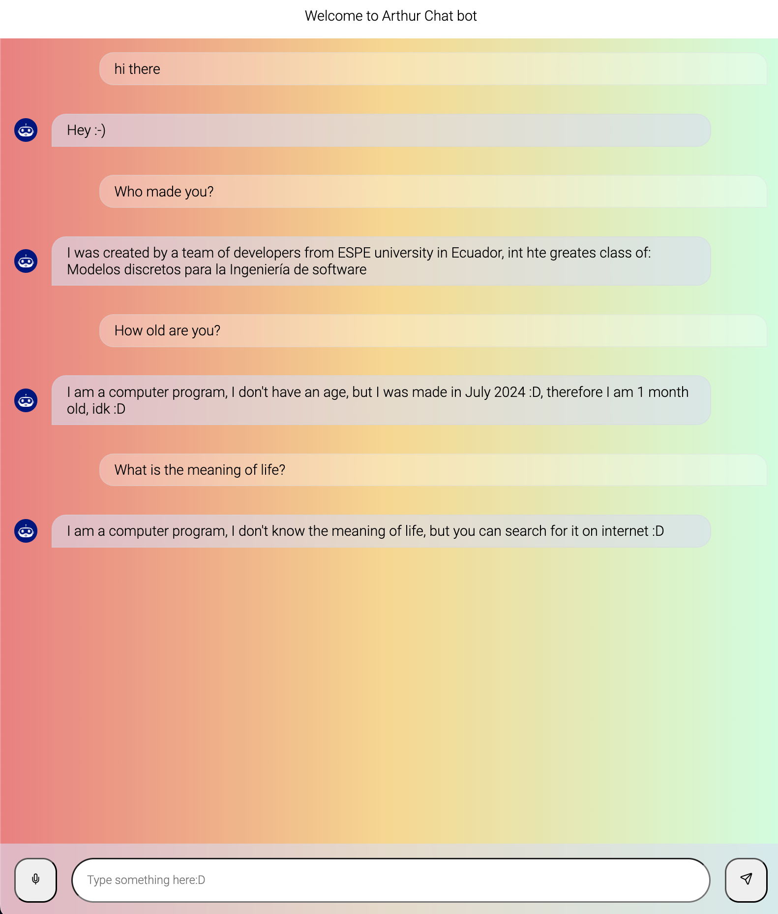

# Arthur Chat Bot




Arthur Chat Bot is a deep learning based chatbot that implements Natural Language Processing (NLP) and Natural Language Understanding (NLU) to interact with users. The chatbot is built using the Python programming language and the PyTorch library. The chatbot is designed to understand and respond to user queries in a conversational manner, using a json db file to store posible responses.

## Features

Arthir chatbot also is a full stack application that uses Angular for the frontend and Flask for the backend. The frontend is a simple chat interface that allows users to interact with the chatbot. The backend is a RESTful API that handles the communication between the frontend and the chatbot.

Also include a desktop application that uses the same chatbot model to interact with users. The desktop application is built using the Electron framework.

You can go to the only-frontent-repo [here](https://github.com/Cotbert2/SimpleChatBotlnterface).


## Installation

First setup the python virtual environment by running the following command:

```bash
python -m venv venv
```

To install the required dependencies, run the following command:

```bash
pip install -r requirements.txt
npm install
```

*** Start frontend*** To start the frontend, run the following command:

```bash
ng serve
```

*** Start backend*** To start the backend, run the following command:

```bash
python server.py
```

*** Open Desktop App*** To open the desktop app, run the following command:

```bash
npm run electron
```
